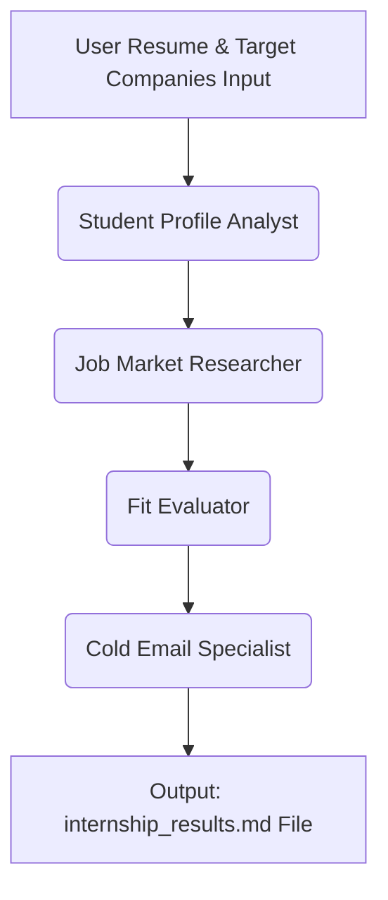

# 🚀 Internship Autopilot & CrewAI Masterclass

<p align="center">
  <a href="#"></a>
  <a href="https://github.com/joaomdmoura/crewai"></a>
  <a href="#"></a>
  <a href="#"></a>
  <a href="#"></a>
</p>

An intelligent orchestrator that completely automates your internship search process. By deploying an asynchronous crew of specialized AI agents, this project parses resumes, conducts real-time target market research, scores technical alignment, and drafts precise cold email outreach campaign materials. It also comes with a sleek, interactive workshop slide deck for presentations.

---

## 🌟 Core Features

| Feature | Component | Description |
| :--- | :--- | :--- |
| **Deep Profile Parsing** | `Student Profile Analyst` | Extracts tech stack proficiencies, metrics-driven projects, and structural gaps. |
| **Market Intelligence** | `Job Market Researcher` | Map roles and distinct hiring expectations across target firms (e.g., Google, Razorpay). |
| **Alignment Scoring** | `Fit Evaluator` | Quantifies compatibility on a `0-100` index and assigns strict action flags. |
| **Outreach Synthesis** | `Cold Email Specialist` | Drafts crisp (<150 words), high-conversion cold letters matching your true voice. |

---

## 🏗️ Multi-Agent Architecture

The workflow runs a sequential multi-agent execution pipeline:



## 📁 Repository Structure

* **`InternshipAutopilot.ipynb` 🤖**: The execution engine containing the CrewAI setups, task definitions, and configuration logic.
* **`CrewAI.html` 🎨**: A premium, dark-mode workshop slide deck constructed with modern typography (`Outfit` & `DM Sans`) and custom interactive navigation mechanisms.

---

## ⚙️ Installation & Workspace Setup

### 1. Environment Installation
Install the core automation frameworks using `pip`:

```bash
pip install -q crewai crewai-tools
```
### ⚙️ 2. API Credentials Configuration

This pipeline uses **Gemini 2.5 Flash** for low latency and sharp execution. Set your credential depending on your execution workspace:

#### 🌐 Google Colab Workspace
Add your API key inside the Colab Left-Sidebar Secrets panel (**🔑**) with the exact label name: `GEMINI_API_KEY`.

#### 💻 Local Development Workspace
Export the credential parameter directly to your terminal environment variables:

```bash
export GEMINI_API_KEY="your-gemini-api-key-here"
```

### 🚀 Execution Guide

1. Launch `InternshipAutopilot.ipynb` using Google Colab or your local Jupyter instance.

2. Navigate to the user configuration cell and substitute your personal credentials inside the `MY_RESUME` multi-line block:

```python
MY_RESUME = """
Your Name
Your Degree / University
Skills, Projects, Experience...
"""
```

3. Adjust the target list array to focus on your preferred destination companies:
```python
TARGET_COMPANIES = ["Google", "Razorpay", "Zepto", "Microsoft"]
```

4. Select **Run All Cells**. The crew will initialize the agents, run the automated steps, and immediately download your tailored markdown document.

---

### 📊 Sample Workflow Outputs

The generated report (`internship_results.md`) contains structured blocks mapping out your next actions:

```markdown

**Company:** Zepto

**Subject:** Software Engineer Internship - Core Infrastructure Optimization

Dear [Hiring Manager Name],

I'm reaching out about a Software Engineer internship at Zepto. I'm impressed by your rapid delivery model and believe my backend development and deployment skills align well with your needs.

My "E-Commerce Price Tracker" project involved building a Node.js/MongoDB application with web scraping, serving 200+ active users. I also developed an "AI-Powered Resume Analyzer" using FastAPI and React, deploying it on AWS EC2, which processed over 500 requests with 87% accuracy. These projects show my ability to build and deploy functional, user-facing systems.

I'm eager to contribute to Zepto's fast-paced environment. Would you be open to a brief 15-minute call to discuss my experience?

Thank you,

Priya Sharma
```
